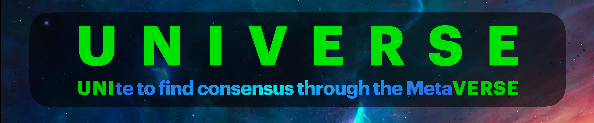

  

<h3 align="center">The Ultimate Tech for Good &nbsp;&nbsp;&nbsp;to&nbsp;&nbsp;&nbsp;Master the Infinite Game</h3>

<strong>Building, Decentralizing & Governing — Rooted in Cypherpunk Ethos</strong>

   

> This is the interactive WHITEPAPER : &nbsp;&nbsp;&nbsp; ***Portal to the Possible***  
> a map of symbolic layers, protocol principles, and pathways into action.  
>
> Each section is a lens into the whole — dive deeper by exploring the title links.

 

### [PHILOSOPHY – WHY](docs/PHILOSOPHY.md) 

**Building the ultimate Tech for Good to Master the Infinite Game —  
providing Hope, Prosperity, and Well-being — is the essence of a fulfilling life purpose.**

> _The Soul beneath the System. The Motivation behind the Mission. The Reason before the Code._

---

 

### [VISION – HOW](docs/VISION.md) 

To serve as the **Multiverse** — the greatest public good — by creating a self-reinforcing system that rewards, unites, and protects.

To build sovereignty-first digital infrastructure that empowers societies to  
**UNIte to find consensus through the MetaVERSE** — unlocking solutions for well-being, prosperity, and long-term alignment.

> _A Visualization of **Human Progress** — and a Framework for **Shared Responsibility**._

---

 

### [MISSION – WHAT](docs/MISSION.md) 

- **The Truth Engine** → Enables rational choices in AI alignment & governance  
- **The Holy Grail** → Find solutions through consensus in crucial problem solving  
- **GLOBIND** → *Globally Aligned in Morals and Ethics*  
- **Protection Protocol** → Safeguards society’s most valuable asset  

> ***Most Immersive Experience — across all technologies, realities, and rituals.***

---

 

### [BUIDL4 – WHO](docs/BUIDL4.md) 

UNIVERSE welcomes:

- 🧠 Critical thinkers, ethical devs, sovereignty advocates  
- 🏛 Institutions seeking rational infrastructure  
- 🌍 Communities aligned with sustainability and truth  
- 🤝 Citizens who want to **learn, express themselves, find soulmates, and make better choices**

> 100% inclusive. Value-aligned. Action-ready.

---

 

### [MANIFESTO – UNIVERSE.DAO](docs/MANIFESTO.md) 

_This protocol is not just code — it’s conviction._

Once fully decentralized, **UNIVERSE.DAO** becomes a **guardian** of its founding ethos:

✅ Sovereignty · ✅ Resilience · ✅ Long-term Integrity

> _A guide to protect freedom, encourage participation, and sustain the Infinite Game._

---

 

### [ARCHITECTURE – SYSTEMS](docs/ARCHITECTURE.md) 

UNIVERSE’s systems are intentionally deployed in progressive modules — aligned, interdependent, and layered to Master the Infinite Game.

Together, they form the backbone of a moral infrastructure built for clarity, sovereignty, and long-term coordination.

> _This is not just architecture — it’s alignment in motion._

---

 

### [ROADMAP – MILESTONES](docs/ROADMAP.md) 

UNIVERSE unfolds in symbolic phases — each marking a deeper threshold of alignment, sovereignty, and trust.

| Phase | Name        | Subtitle                                     | Folder |
|------:|-------------|----------------------------------------------|--------|
| 0 🌒 | BACKBONE     | Root Spark of the Soul                        | `0 DAO - Layer Zero/` |
| 1 🌓 | BUIDL        | Privilege to Build the Foundation 4ALL        | `1 MOMENTUM/` |
| 2 🌕 | BIG BANG     | Ignition of Collective Sovereign Intelligence | `2 SOVRIN/` |
| 3 🌑 | BLACK HOLE   | Gravity of the UNIVERSE                       | `3 D-UI/` |

> _Current Stage: **Phase 1 – BUIDL** 🌓_

---

 

## WHITEPAPER Index – Portal to the Possible 

 

### Foundational Principles
- [PHILOSOPHY – WHY](docs/PHILOSOPHY.md)  
- [VISION – HOW](docs/VISION.md)  
- [MISSION – WHAT](docs/MISSION.md)  
- [BUIDL4 – WHO](docs/BUIDL4.md)  
- [MEMES – MEANING](1%20MOMENTUM/1.1%20MEMES.md)

 

### Pillars of Human Progress — D-UI
- [INTRO – Pillars of Human Progress](3%20D-UI/3.0%20INTRO.md)  
- [VOW – The Ethical Core](3%20D-UI/3.1%20VOW.md)  
- [GUIDE – The Navigation Protocol](3%20D-UI/3.2%20GUIDE.md)  
- [COMMON – The Moral Compass](3%20D-UI/3.3%20COMMON.md)  
- [EQUILIBRIUM – The Balancing Force](3%20D-UI/3.4%20EQUILIBRIUM.md)  
- [SUCCESS – Measurement of Meaning](3%20D-UI/3.5%20SUCCESS.md)  
- [COMUD – The Intelligence Commons](3%20D-UI/3.6%20COMUD.md)

 

### Governance & Protocol Commitments
- [MANIFESTO – What We Defend](docs/MANIFESTO.md)  
- [DAOIST – Layer Zero](0%20DAO%20-%20Layer%20Zero/DAOIST.md)  
- [UIP – UNIVERSE Improvement Proposals](0%20DAO%20-%20Layer%20Zero/0.2%20UIP/README.md)

 

### Systems & Infrastructure
- [ARCHITECTURE – Modular Systems Overview](docs/ARCHITECTURE.md)  
- [ROADMAP – The Journey *Is* the Goal](docs/ROADMAP.md)  
- [PROJECT STRUCTURE – Symbolic Folder Map](docs/STRUCTURE.md)       
- [LICENSE – UNIVERSE.4ALL](LICENSE.md)  
- [GLOSSARY – Core Terminology](docs/GLOSSARY.md)

 

### HIGHLIGHTS
- [UNIque SOULSHAPER quotes, gems, poems and VERSE](docs/HIGHLIGHTS.md)

 

### CONTRIBUTING
- [How to Join & Participate](CONTRIBUTING.md)

---

**UNIVERSE**  
More than just a MEME. It’s a revolutionary paradigm shift.

> _🔓 Licensed under UNIVERSE.4ALL — use with responsibility, act with clarity, build for eternity._
