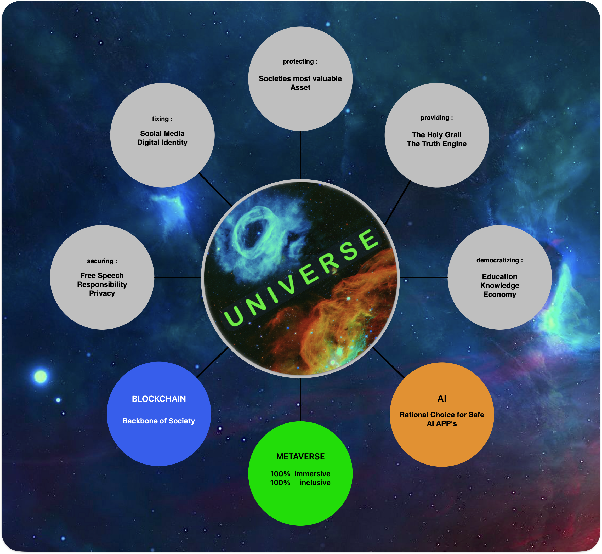

> [VISION](../README.md#intro-vision) &nbsp;&nbsp;&nbsp;&nbsp;&nbsp; ← Return to README : HOW Intro 
>  
> To serve as the **Multiverse** — the greatest public good — by creating a self-reinforcing system that rewards, unites, and protects.  
>  
> To build sovereignty-first digital infrastructure that empowers societies to  
> **UNIte to find consensus through the MetaVERSE** — unlocking solutions for well-being, prosperity, and long-term alignment.  
>  
>_A Visualization of **Human Progress** — and a Framework for **Shared Responsibility**._

---

 

# VISION  
**How UNIVERSE Serves the Infinite Game**

A **living protocol** — designed not to control, but to coordinate.  
Not to centralize power, but to amplify clarity, care, and sovereignty.

Systems should:
- Be legible to humans  
- Be aligned with values  
- Invite participation through meaning — not manipulation

---

 

  

 

## Core Tenets

1. **Philosophy First** — Strategy follows values  
2. **Sovereignty-by-Default** — Privacy is power  
3. **Coherence Over Consensus** — Truth before agreement  
4. **Signal Over Noise** — Direction over distraction  
5. **Tool-as-Teacher** — Infrastructure should elevate  
6. **Memes-as-Protocol** — Symbols carry structure

---

 

## What We're Composing

UNIVERSE is a **civic protocol** —  
where ethics, incentives, and intelligence are interwoven.

We are building:
- Truth-aligned infrastructure  
- Systems that protect freedom through design  
- Incentives that reward responsibility  
- A foundation to sustain the Infinite Game

> This isn’t a product.  
> It’s a **long-term coordination engine** for people who care.

---

 

## A Vision That Evolves

This isn’t a final form.  
It’s a **shared direction** — refined through participation.

If you build with care, code with conscience, or think in systems —  
**you’re already part of this.**

---

 

## Contributing to the Vision

This vision lives through participation.  
If it resonates — build, write, share, or protect.

→ [Start here → CONTRIBUTING.md](../CONTRIBUTING.md)

---

 

## Related Docs

- [PHILOSOPHY – WHY](PHILOSOPHY.md)  
- [MISSION – WHAT](MISSION.md)  
- [BUIDL4 – WHO](BUIDL4.md)

---

 

**UNIVERSE**  
Built to align clarity with power.  
Built to protect what matters.
